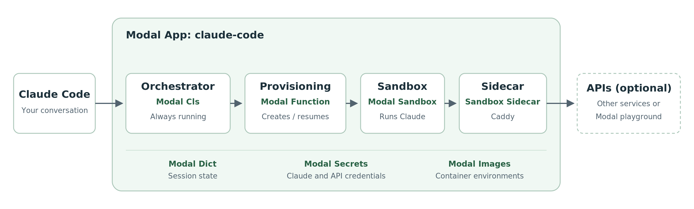

# How it works

Use the [README](../README.md) for setup and customization. This page explains
the runtime and helps with debugging.



## Components

| Component | Modal primitive | Job |
| --- | --- | --- |
| [Orchestrator](../src/app.py#L250) | Cls (`@app.cls`) | Stays warm, receives Claude assignments, and queues provisioning. |
| [Provisioning](../src/app.py#L79) | Function (`@app.function`) | Creates or resumes a sandbox and starts its sidecar. |
| [Sandbox](../src/sandbox.py) | Sandbox | Runs Claude and holds the conversation's files. |
| [Sidecar](../src/Caddyfile) | Sandbox Sidecar | Runs Caddy to forward API requests and add credentials. |

The orchestrator and provisioning Function share an image. The sandbox and sidecar
each have their own. [images.py](../src/images.py) defines these images, which are
built and published under the `claude-code` app during deployment.

## Starting and resuming sessions

1. The orchestrator's [spawn hook](../src/spawn_runner.py) receives a temporary
   Claude token and queues the [provisioning function](../src/app.py).
2. Provisioning reserves the assignment and creates a sandbox.
3. It records the Sandbox ID, starts the sidecar, and waits for it to be ready.
4. It supplies the token to the sandbox. Claude starts.

Recording the Sandbox ID **before** Claude starts lets later assignments find
the right sandbox. Reservations prevent duplicate creation.

When a conversation resumes, provisioning waits for the previous sandbox to exit
and starts a replacement from its filesystem snapshot. It supplies a fresh Claude
token and starts a new sidecar.

The snapshot keeps project files and installed packages. The startup script,
`src/sandbox.py`, comes from the **current deployment**, so fixes to how Claude is
launched also apply to resumed sessions. Processes and memory are not restored.
Package changes require a new conversation.

## Credentials and API access

Your local Modal login deploys the infrastructure that hosts Claude. API access
inside Claude is configured separately:

| Credential | Receives it |
| --- | --- |
| Claude environment ID and secret | Orchestrator and provisioning function |
| Temporary Claude session token | Sandbox |
| API Secrets listed in `SIDECAR_SECRET_NAMES` | Sidecar |

The sidecar's credentials stay outside the sandbox's filesystem snapshot. Every
replacement sidecar receives the currently configured Secrets.

By default, the API Secret list is empty. The optional
[Modal playground](../README.md#optional-work-on-a-modal-codebase) adds credentials
for Claude to build and run Modal apps in `claude-code-playground`.

The sidecar exposes two ports:

| Address | Purpose |
| --- | --- |
| `http://sidecar:8080` | HTTP APIs, available to Claude as `CLAUDE_SIDECAR_URL`. |
| `http://sidecar:8081` | Modal SDK traffic over gRPC, enabled by the playground setup. |

[Caddyfile](../src/Caddyfile) defines the routes and credential headers. Without a
configured HTTP API, port 8080 returns HTTP 503; Claude sessions still work.

For the playground, [sandbox.py](../src/sandbox.py#L41) points the SDK at port 8081
and gives it placeholder credentials. The sidecar replaces those with the real
values. `MODAL_CONFIG_PATH=/dev/null` prevents use of a saved local profile.

## Troubleshooting

In your local terminal, using the deployment's Modal profile and environment:

```sh
uv run modal app logs claude-code
```

Logs identify the session, assignment, and failing stage.

| Symptom | What to check |
| --- | --- |
| Missing Secret or key | Create it in the same Modal environment as the hosting app. See [setup](../README.md#2-add-credentials). |
| Sidecar access restriction | Modal's [sidecar example](https://modal.com/docs/examples/sidecar_secrets_injection) lists workspace allowlisting. Check workspace access with Modal. |
| Example API returns HTTP 401 | Direct requests need credentials. Inside Claude, use `$CLAUDE_SIDECAR_URL/`; check that its proxy token allows `claude-code-playground`. |
| `modal app list` fails inside Claude | Complete the [playground setup](../README.md#optional-work-on-a-modal-codebase) and check the API token's Contributor access. |
| `sandbox_running` | Wait for the previous sandbox to exit before retrying. |
| `needs_operator` or an ambiguous create failure | Inspect the [session state](#session-state) and existing sandbox before retrying. Creation may have succeeded despite a lost response. |

## Session state

The Modal Dict `claude-code-sessions` records the latest sandbox for each
conversation and reservations that prevent duplicate work.

| Key | Purpose |
| --- | --- |
| `environment_id` | Binds the Dict to one Claude environment. |
| `order:<order_id>` | Records that an assignment was claimed. |
| `generation:<session_uuid>:<n>` | Reserves one sandbox launch. |
| `session:<session_uuid>` | Tracks the conversation's latest sandbox. |

Read the **session record** to find `sandbox_id`. It also holds the assignment's
`order_id`, the launch count (`generation`), and, after a resume,
`previous_sandbox_id` and `snapshot_image_id`.

If the session's `sandbox_id` is `null`, creation is unconfirmed. Check logs and
existing sandboxes before clearing a reservation; otherwise, retrying can create
duplicate work. Order and generation reservations never change, so a `null`
Sandbox ID in a generation reservation is expected.

The Dict contains private routing metadata, including the Claude environment ID.
Tokens, API keys, and workspace files are stored elsewhere. Keep the Dict across
redeployments to retain resume history; Modal's inactivity retention still applies.

## Update credentials

Rerun the corresponding `modal secret create` command from the README with
`--force` and updated values. Include **all keys**: this replaces the entire Secret.

Redeploy afterward. New sidecars receive updated API credentials on the next
sandbox launch.

## Operating defaults

- Use one deployment per Claude environment. The orchestrator stays running until stopped.
- Sandboxes release after one minute idle, retire after 57 minutes, and have a one-hour hard limit and a five-minute Modal idle timeout.
- Inspect or stop the app and sandboxes in the Modal dashboard.
- To discard resume history, stop the app and sandboxes before deleting `claude-code-sessions`.

Private repository authentication and additional network destinations need their
own configuration. See the [customization links](../README.md#customize).

<details>
<summary>Developer checks</summary>

Run locally after changing the implementation:

```sh
uv run pytest
uv run ruff check .
```

After deploying changes to startup or provisioning:

**Basic setup:** start a session with the [README prompt](../README.md#4-use-claude),
with the playground disabled and no API Secrets configured.

**Modal access:** enable the [playground](../README.md#optional-work-on-a-modal-codebase)
and try its prompt. Expect the app list and `Hello from Modal` response.

**Deployment:** ask Claude:

> Read `/opt/claude-code-version` and tell me its contents.

Compare it with the `Deployment ID` printed when deploying. This identifies the
deployment that launched the sandbox; already-running sandboxes keep their old ID.

**Resume:** ask Claude:

> Create `/workspace/resume-check.txt` containing `hello from the first sandbox`.

Wait for the sandbox to exit, then ask in the **same conversation**:

> Read `/workspace/resume-check.txt` and tell me what it contains.

Expect the original text. Use an untracked file because Claude's repository
checkout can reset tracked Git changes.

To render the diagram after editing [its SVG source](architecture.svg):

```sh
uvx --from cairosvg cairosvg docs/architecture.svg -s 2 -o docs/architecture.png
```

</details>
